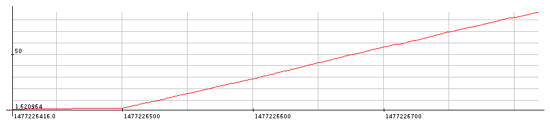
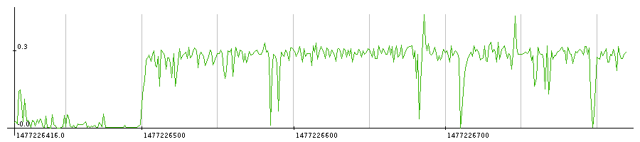

# Dalla Stats 

Scrape traffic statistics from TP-LINK AC750 Archer C20 Router

## Usage
```
usage: dalla-stats.py [-h] [-u USERNAME] [-p PASSWORD] [-i INTERVAL]
                      [-d DEVICE_LOG_DIR] [-e USER_LOG_DIR]
                      [-c COMMUNE_LOG_FILE] [-m USER_MAP_FILE]

optional arguments:
  -h, --help            show this help message and exit

  -u USERNAME, --username USERNAME
                        the router admin username

  -p PASSWORD, --password PASSWORD
                        the router admin password

  -i INTERVAL, --interval INTERVAL
                        the interval in seconds to update the statistics

  -d DEVICE_LOG_DIR, --device-log-dir DEVICE_LOG_DIR
                        the folder to store device log files

  -e USER_LOG_DIR, --user-log-dir USER_LOG_DIR
                        the folder to store user log files

  -c COMMUNE_LOG_FILE, --commune-log-file COMMUNE_LOG_FILE
                        the path of the commune log file

  -m USER_MAP_FILE, --user-map-file USER_MAP_FILE
                        the path of the user map .csv
```

## Features
- Records device, user, and total traffic usage from router
- Produces .csv for each device, user and total
    - Adds record to csv at each interval to allow for generation of graphs
    - Format: `Time, Total Bytes, Delta, On-Peak, Off-Peak`
- Associates devices to users using MAC addresses

## Planned Features
- [ ] Throttle user once they reach their quota
- [ ] Web interface to view current traffic usage
- [ ] Classify traffic as On-Peak and Off-Peak
- [ ] Purge log files after certain time, keeping summary intact
- [ ] Real-time only mode (Produces no .csv for graphs)
- [ ] Alerts when user reaches certain quota
- [ ] Produce a human readable summary
- [ ] Handle invalid router responses (invalid password, etc)
- [ ] Better logging to stdout

## Example graphs
Some graphs produced using [LiveGraph](http://www.live-graph.org/)

Total Data Usage:


Delta:

